可以。你现在正在学习 **FSM（有限状态机）+ 消息系统（Message/Event System）**，非常适合做一些**规则简单、系统之间交互明显**的小游戏。

我建议不要一开始做大型 RPG，而是选择能够明确体现：

> **FSM 管“对象现在处于什么状态”**
> **消息系统管“对象之间发生了什么事情”**

下面给你几个从简单到复杂的方案。

---

# 方案一：金币猎人

**类型：俯视角动作小游戏**

玩家在地图中移动，攻击不断出现的怪物，击杀怪物获得金币，用金币购买强化。

### 核心玩法

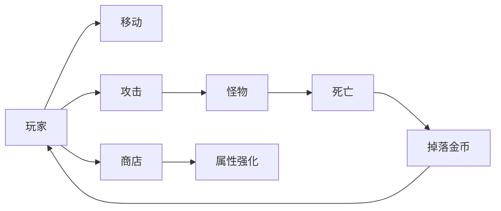

### FSM

玩家：

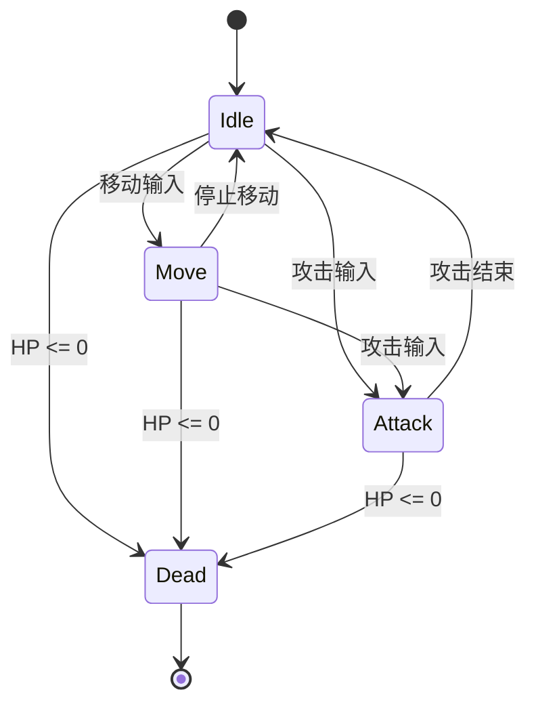

怪物：

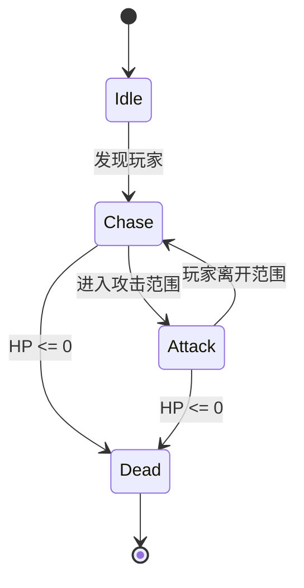

### 消息系统

例如：

```text
PlayerAttack
    ↓
MonsterDamaged
    ↓
MonsterDead
    ↓
CoinDropped
    ↓
PlayerCoinChanged
    ↓
UI更新
```

消息可以设计成：

```csharp
PlayerAttackMessage
DamageMessage
MonsterDeadMessage
CoinCollectedMessage
PlayerCoinChangedMessage
```

### 难度

⭐⭐

### 适合学习

非常适合作为你的**第一个 FSM + 消息系统项目**。

---

# 方案二：小型坦克战场

**类型：第三人称 / 俯视角坦克射击**

这个方案和你之前做过的坦克、炮塔、敌人 AI 比较接近。


### 游戏玩法

玩家控制坦克：

```text
移动
 ↓
瞄准
 ↓
开炮
 ↓
击毁敌人
 ↓
获得资源
 ↓
升级坦克
 ↓
进入下一关
```

### 玩家 FSM

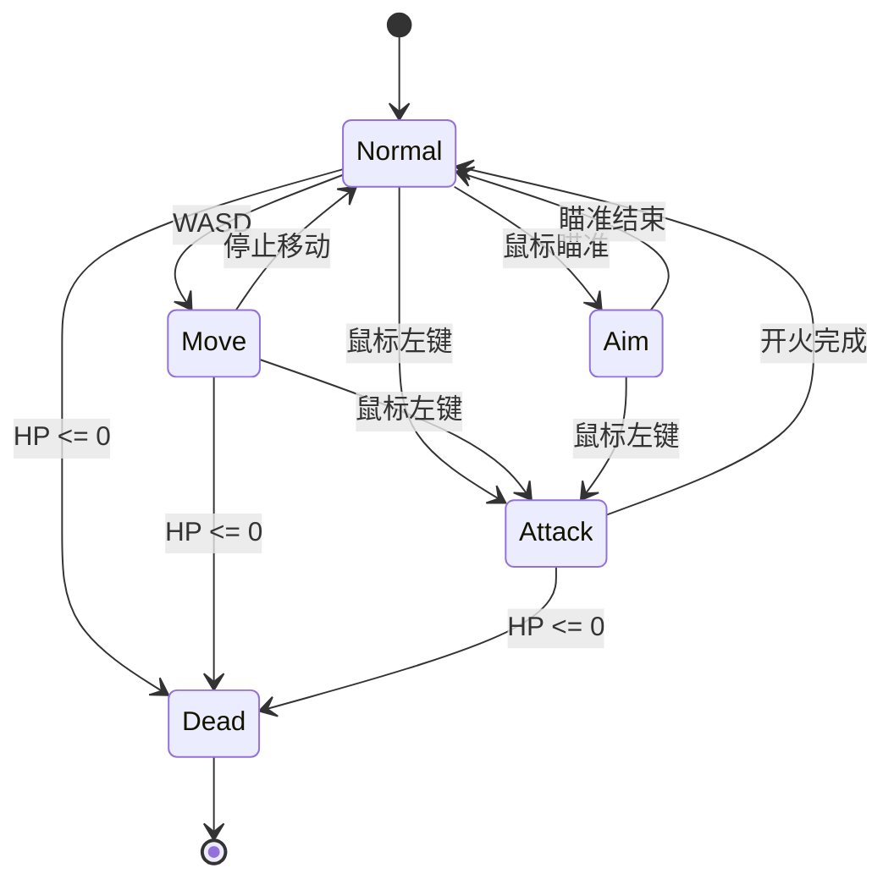

### 敌人 FSM

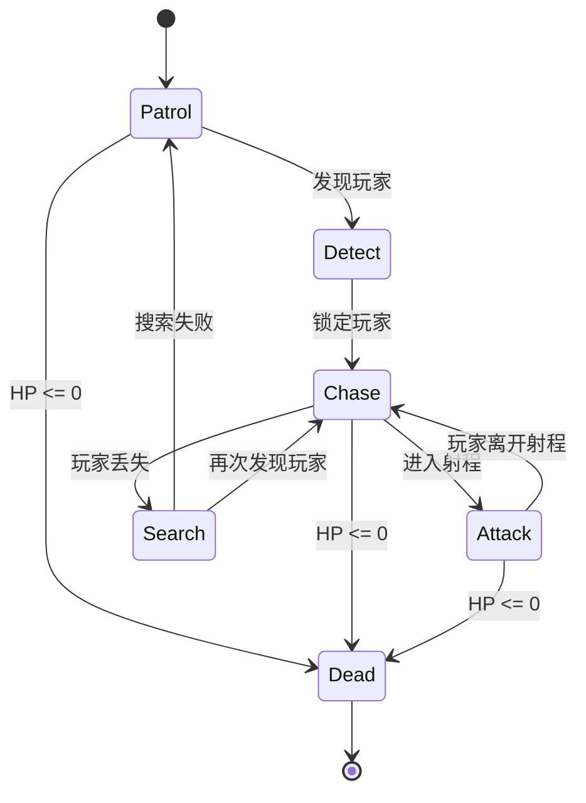

### 消息系统

例如：

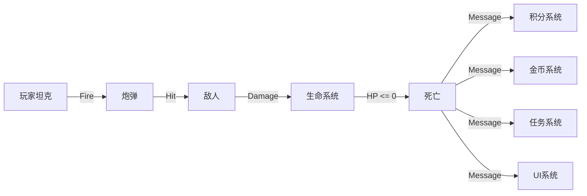

### 消息

```csharp
FireMessage
BulletHitMessage
DamageMessage
EnemyDeadMessage
CoinChangedMessage
ScoreChangedMessage
LevelCompleteMessage
```

### 难度

⭐⭐⭐

### 学习价值

**非常高。**

因为它能够同时练习：

* 玩家 FSM
* AI FSM
* 战斗系统
* 消息系统
* UI
* 游戏流程
* 关卡系统

---

# 方案三：生存 10 分钟

**类型：吸血鬼幸存者类**

这个方案特别适合练习**大量对象 + 消息系统**。


玩家不断移动，敌人从四面八方出现。

```text
玩家
 ↓
自动攻击
 ↓
敌人死亡
 ↓
经验
 ↓
升级
 ↓
选择技能
 ↓
继续生存
```

### 玩家 FSM

实际上可以非常简单：

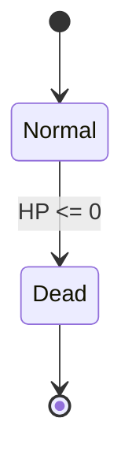

反而是**消息系统成为重点**。

### 消息流

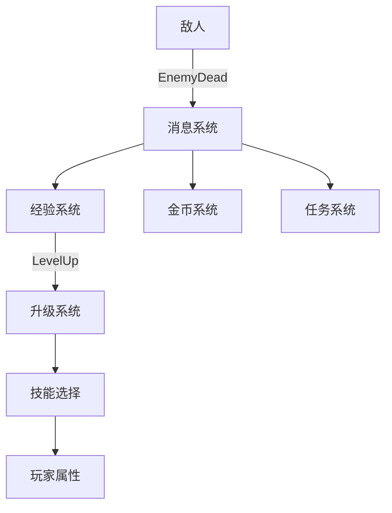

例如：

```csharp
EnemyDeadMessage
{
    EnemyId
    Position
    Exp
    Coin
}
```

消息系统广播：

```text
EnemyDead
     │
     ├──→ ExperienceSystem
     │
     ├──→ CoinSystem
     │
     ├──→ QuestSystem
     │
     └──→ UI
```

### 难度

⭐⭐⭐

### 学习价值

**消息系统学习价值非常高。**

---

# 方案四：小型 RPG 地牢

**类型：2D / 3D Dungeon Crawler**

玩家进入地牢：

```text
探索
 ↓
发现怪物
 ↓
战斗
 ↓
获得装备
 ↓
打开宝箱
 ↓
寻找钥匙
 ↓
进入下一层
```

### 玩家 FSM

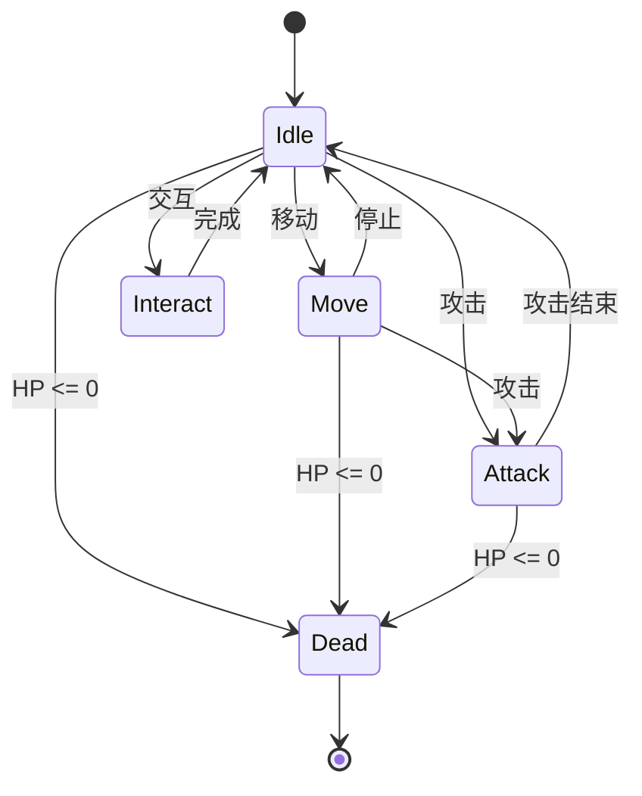

### 怪物 FSM

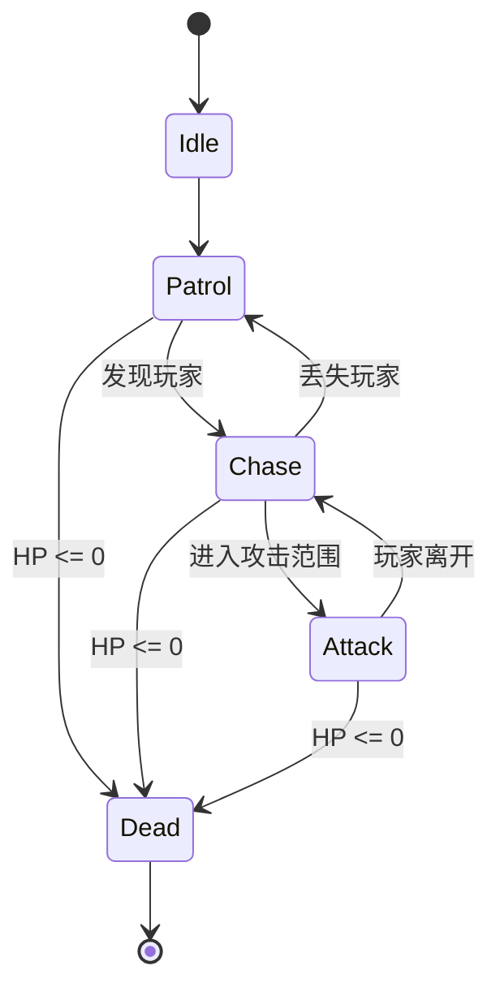

### 消息系统

这个项目可以出现很多消息：

```text
PlayerEnterRoom
EnemySpawn
EnemyDead
Damage
PlayerDead
ItemDropped
ItemPicked
ChestOpened
KeyObtained
DoorOpened
QuestCompleted
LevelCompleted
```

例如：

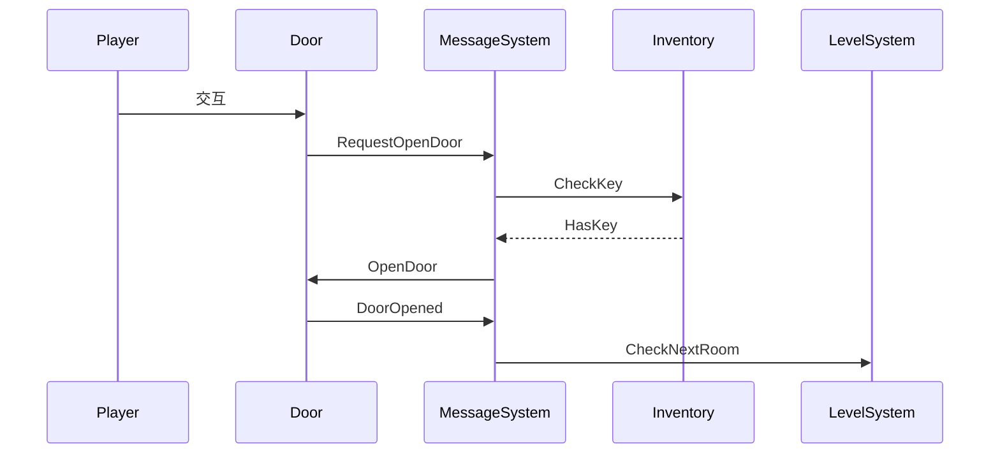

### 难度

⭐⭐⭐⭐

---

# 方案五：塔防游戏

**类型：Tower Defense**

这个方案非常适合理解**消息系统为什么有价值**。


地图：

```text
出生点
  ↓
  ↓
 🐲 → 🐲 → 🐲
          ↓
       防御塔
          ↓
        基地
```

### 敌人 FSM

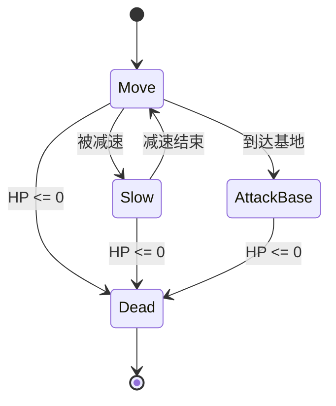

### 防御塔 FSM

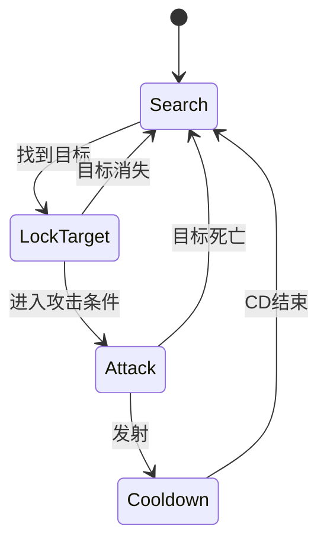

### 消息系统

这里会出现非常漂亮的事件链：

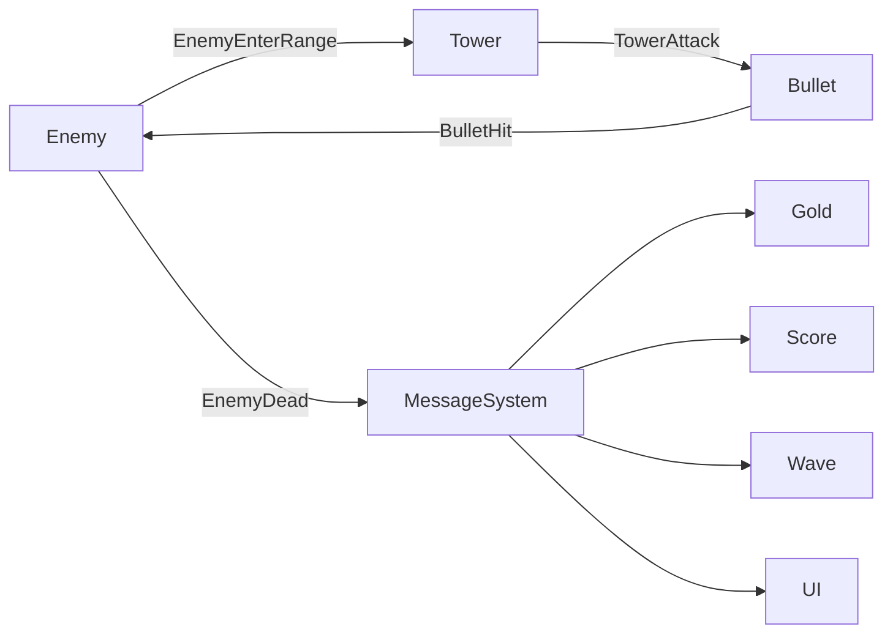

### 难度

⭐⭐⭐⭐

---

# 方案六：经营 + 冒险游戏

这个方案比较有意思，因为它可以模拟一个真正的小型商业游戏架构。

例如：

> **玩家经营一家武器店，同时出去冒险。**

```text
冒险
 ↓
获得材料
 ↓
回城
 ↓
制作武器
 ↓
出售
 ↓
获得金币
 ↓
升级店铺
 ↓
解锁地图
```

### 商店 FSM

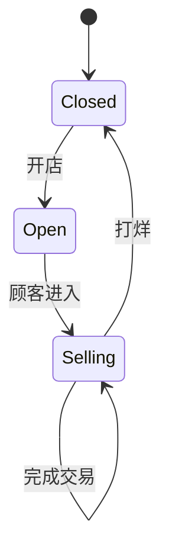

### 顾客 FSM

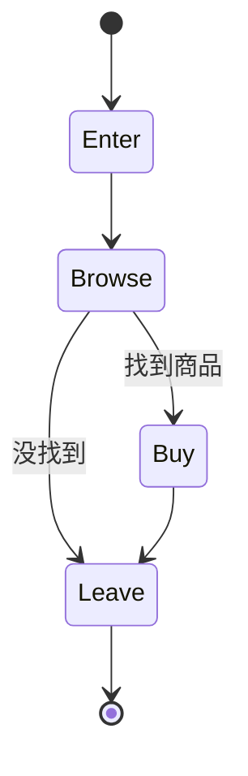

### 消息

```text
CustomerEnter
CustomerBuy
CustomerLeave

ItemCrafted
ItemSold

GoldChanged
InventoryChanged

ShopLevelUp
QuestCompleted
```

### 难度

⭐⭐⭐⭐⭐

这个方案更接近真正的商业游戏。

---

# 如果你的目标是“专门学习 FSM + 消息系统”

我建议按照下面的顺序做：

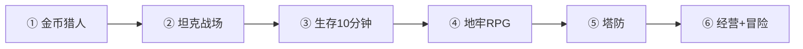

| 项目     |   FSM |  消息系统 |   AI |  系统架构 |    难度 |
| ------ | ----: | ----: | ---: | ----: | ----: |
| 金币猎人   |   ★★★ |   ★★★ |   ★★ |    ★★ |    ⭐⭐ |
| 坦克战场   |  ★★★★ |  ★★★★ | ★★★★ |   ★★★ |   ⭐⭐⭐ |
| 生存10分钟 |    ★★ | ★★★★★ |  ★★★ |  ★★★★ |   ⭐⭐⭐ |
| 地牢RPG  |  ★★★★ | ★★★★★ | ★★★★ |  ★★★★ |  ⭐⭐⭐⭐ |
| 塔防     | ★★★★★ | ★★★★★ | ★★★★ |  ★★★★ |  ⭐⭐⭐⭐ |
| 经营+冒险  |  ★★★★ | ★★★★★ |  ★★★ | ★★★★★ | ⭐⭐⭐⭐⭐ |

## 我最推荐你做：**小型坦克战场**

因为它刚好能够把你正在学习的几个东西串起来：

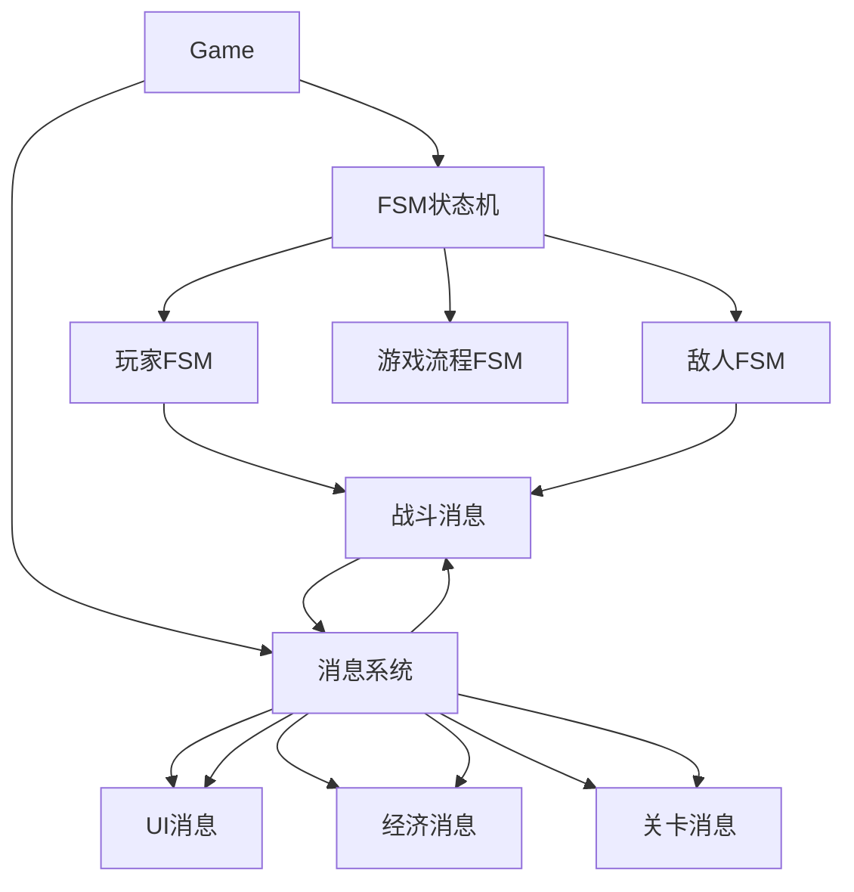

最终可以把它做成一个很小但完整的 Unity Demo：

**1 张地图 → 1 个玩家坦克 → 3 种敌人 → 3 种武器 → 金币 → 商店 → 5 个关卡 → Boss。**

这样做完以后，你的 FSM 和消息系统就不是“单独学的代码模块”，而是会真正变成一套**游戏架构基础设施**。
